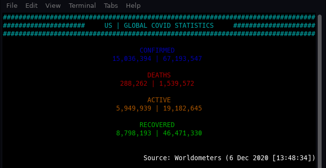

# Coronavirus-Stats

Simple python program that displays (in the shell/terminal) the current COVID-19 statistics (US and global).

Alternately, a wrapper for the covid library from PyPi.

## Dependencies

python

[colorama](https://pypi.org/project/colorama/) (might already be installed)

[covid](https://pypi.org/project/covid/) (version as of coding: 2.4.0)

## Install

After making sure you have the proper dependencies installed, clone this repo (or copy 'run.py).

You may need to make run.py executable. 
On Linux (in your terminal), navigate to the directory where run.py is contained and type 'chmod a+x ./run.py'.

## Running:

This is a CLI program, so it is happy to be run from the terminal ([command prompt](https://www.howtogeek.com/235101/10-ways-to-open-the-command-prompt-in-windows-10/) in Windows). If you are using Windows, you should be able to run it by double-clicking the 'run.py' file, as if it were an .exe file. 

This has been tested, and works, on Linux and Windows; but it should run on MacOS.
