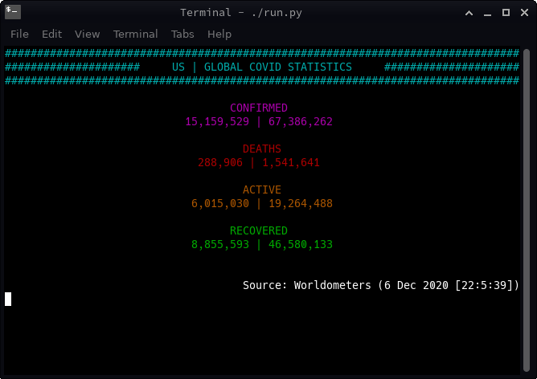
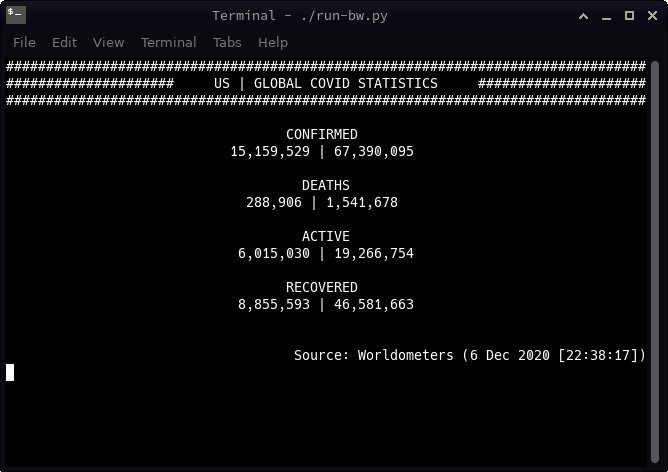

# Coronavirus-Stats

Simple python CLI program that displays the current COVID-19 statistics (US and global).

Alternately, a wrapper for the covid library from PyPi.

## Dependencies

python (V3.6 or Higher)

[colorama](https://pypi.org/project/colorama/) (might already be installed) (Doesn't apply to black-and-white mode)

[covid](https://pypi.org/project/covid/) (version as of coding: 2.4.0)

## Install

After making sure you have the proper dependencies installed, clone this repo (or copy 'coronavirus-stats.py').

You may need to make the .py file executable for your system to run it.

To do this on Linux (in your terminal), navigate to the coronavirus-stats directory and type 'chmod a+x ./coronavirus-stats.py'.

## Running:

This is a CLI program, so it is happy to be run from the terminal ([command prompt](https://www.howtogeek.com/235101/10-ways-to-open-the-command-prompt-in-windows-10/) in Windows). If you are using Windows, you should be able to run it by double-clicking the 'coronavirus-stats.py' file, as if it were an .exe file.

This has been tested, and works, on Linux and Windows; but it should run on MacOS.

## Colorblind or Black-and-White Mode:

Hate or can't see colors well? I got you! Just run 'coronavirus-stats-bw.py' instead.

Wear a mask.
